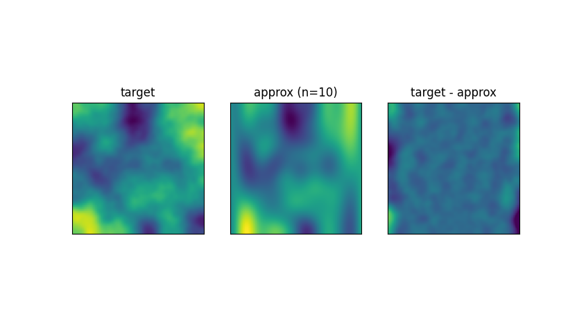

# apx_sph_hmn
Approximation by spherical harmonics.

## Requirement
Python >= 3.10  
(Unconfirmed, but probably works with version >= 3.8)

## Preparing
The following commands can be used to create a virtual environment.
```commandline
python -m venv env
env/Script/activate
pip install -r requirements.txt
```
Alternatively, cloning the repository into an environment where the following libraries are available will also work.
- numpy
- scipy
- matplotlib

## Usage
Approximates a given array by spherical harmonics function 
by specifying a 2D numerical array and the degree to be approximated.  
**NOTE: Only square array is supported.** 

```python
import gen_data
import plot
import fit

size = 64
max_n = 10
ydata = gen_data.gen_noise_2d((size, size), 1.5, 10)  # Generate sample data

param, apx = fit.fit(max_n, ydata)  # Approximate
plot.plot_tgt_apx_res(ydata, apx, max_n)  # Draw original data and Approximated data
```

### Result
The following image is displayed.  


### Performance
On my desktop computer (Core i9-10850K), the above sample script took 15 seconds to run.  
The computation time is approximately proportional to the cube of the degree (`max_n`).

## Mathematics
A **spherical harmonics** are function defined by the following equation:
```math
Y_n^m(\theta, \phi) = \sqrt{\frac{2n + 1}{4\pi}\frac{(n - m)!}{(n + m)!}}e^{im\theta}P_n^m(\cos \phi)
```
where $P_n^m$ are the associated Legendre functions defined by:
```math
P_n^m(x) = \frac{(-1)^m}{2^nn!}(1 - x^2)^{m/2} \frac{d^{n+m}}{dx^{n+m}}(x^2 - 1)^n
```
, $n \geq 0, |m|\leq n$.
In the original definition, the definition area is the following range.
```math
0 \leq \theta \leq 2\pi,\ 0 \leq \phi \leq \pi
```

However, in this library, it limits the definition area as follows.
```math
0 \leq \theta \leq \pi,\ 0 \leq \phi \leq \pi
```
And it changes range of degree as follows.
```math
n \geq 0, \leq m\ \leq n
```
This function is used to approximate the given data as follows.
```math
D(\theta, \phi) \approx \sum_{n=0}^{n_{\max}}\sum_{m=0}^{n} a_n^m Y_n^m(\theta, \phi)
```
where $a_n^m$ is the coefficient representing the magnitude of each component of the spherical harmonic function.  

The `param` in the above script corresponds to that coefficient sequence. 
This `param` is a 1D array, with each component arranged as follows.

```math
a_n^m = [a_0^0,\ a_1^0,\ a_1^1,\ a_2^0,\ a_2^1,\ a_2^2, ...]
```